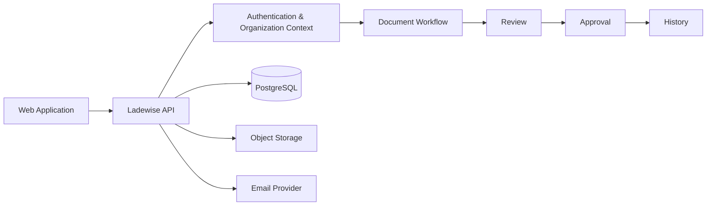

# Ladewise

**Export documentation workflow infrastructure for operational teams.**

Ladewise is designed to help businesses prepare, review, approve, and maintain commercial export documentation with clear ownership and history.

> This repository is a public engineering showcase. Production source code, credentials, customer documents, deployment configuration, and sensitive operational details remain private.

## What Ladewise solves

Export documentation is operationally sensitive.

Teams need to manage:

- document preparation
- human review
- approvals
- corrections
- version history
- organization-level ownership
- secure access
- email-backed account workflows

Ladewise provides a structured workflow around those activities without pretending to replace government portals, customs systems, banks, DGFT, ICEGATE, or other official infrastructure.

## Core principles

- Human review stays in the loop
- Documents have clear ownership
- Changes are traceable
- Approval state is explicit
- Organization boundaries are enforced
- Production systems remain auditable
- External official systems are respected rather than imitated

## Architecture



## Engineering stack

| Layer | Technology |
| --- | --- |
| Frontend | Next.js |
| Language | TypeScript |
| Backend | Java 21, Spring Boot |
| Database | PostgreSQL |
| Migrations | Flyway |
| Authentication | Spring Security |
| API style | REST |
| Object storage | S3-compatible storage |
| Testing | Testcontainers + backend tests |
| Email | Transactional email provider |
| Architecture | Modular monolith |

## System boundaries

Ladewise is intentionally positioned as a workflow and documentation system.

It does **not** replace:

- ICEGATE
- DGFT
- customs authorities
- banking systems
- freight systems
- government filing portals

Instead, it helps teams organize the preparation and internal control of the documentation surrounding those processes.

## Identity and organization model

The platform is built around organization-scoped access.

Typical lifecycle:

```text
Organization registration
    ↓
User account
    ↓
Email verification
    ↓
Authenticated session
    ↓
Organization-scoped access
    ↓
Document workflows
```

## Selected engineering decisions

### Modular monolith

The system uses a modular monolith architecture to keep deployment and operational complexity controlled while preserving clear domain boundaries.

### Explicit security boundaries

Authentication, CSRF protection, CORS policy, organization context, and protected API routes are treated as first-class backend concerns.

### Database migrations

Schema changes are versioned through Flyway rather than being applied ad hoc.

### Production email workflows

Account verification and related identity workflows are integrated with a transactional email provider instead of mocked out in the application architecture.

### Real infrastructure before premature complexity

PostgreSQL and object storage are core infrastructure.

Additional systems such as Redis are introduced only when there is a demonstrated requirement.

## Example workflow

```text
Create export document
    ↓
Attach supporting information
    ↓
Internal review
    ↓
Correction if required
    ↓
Approval
    ↓
Historical record retained
```

## Production concerns represented in the system

- organization isolation
- authentication
- email verification
- CSRF protection
- CORS configuration
- data persistence
- database migrations
- object storage
- review and approval state
- production deployment
- audit-friendly history
- environment-specific configuration

## Public vs private

### Public in this repository

- architecture
- engineering decisions
- product scope
- workflow model
- sanitized technical descriptions

### Kept private

- production source code
- environment variables
- API credentials
- customer export documents
- organization data
- deployment configuration
- private operational logic
- internal infrastructure details

## Built by

**Harmanpreet**

Ladewise is a production-oriented software engineering project focused on Java, Spring Boot, Next.js, PostgreSQL, security, document workflows, and operational systems.
